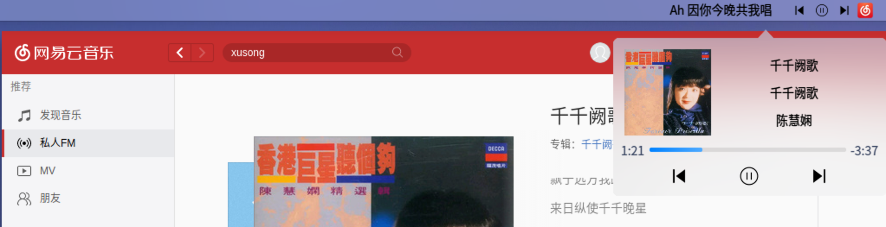
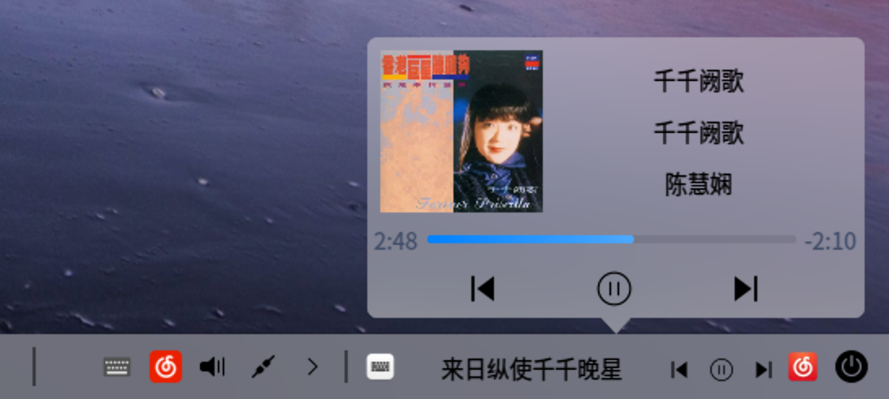

# Mpris2 Music Controller Plugin (dde dock && dde top panel) for Deepin V20

> Attention: All the APIs used in this repo is from the Internet for study ONLY !

> Contact me if it bothers you so that I could remove the APIs.

It is a dde-dock/dde-top-panel plugin which lets you control your current music player.

Features:

1. prev/play/pause/next control on your panel/dock
2. raise the music player window from background by clicking the icon
3. lyric support

### Screenshot

Icons from [www.iconfont.cn](https://www.iconfont.cn/collections/detail?spm=a313x.7781069.0.da5a778a4&cid=4396)
